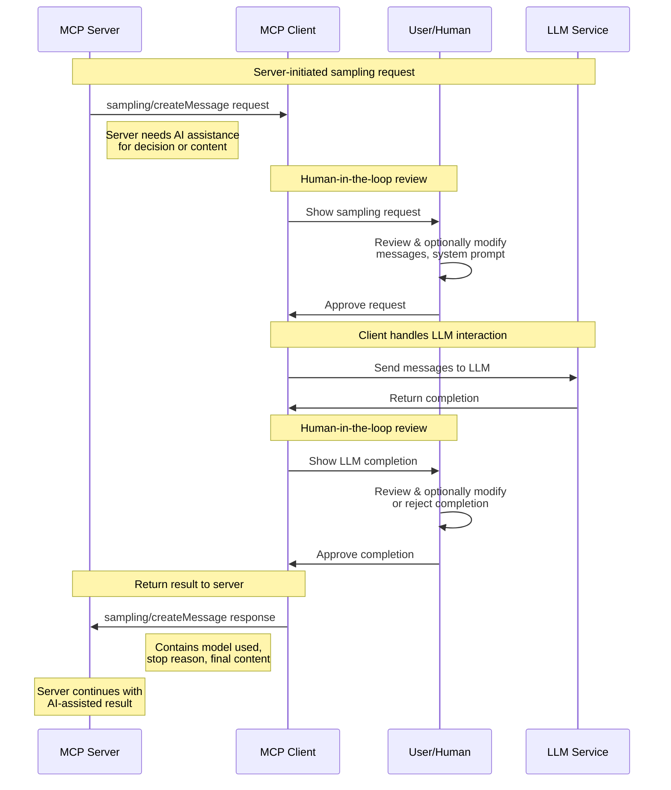

The client component allows your application to connect to MCP servers.

### Basic Client Setup

```swift
import MCP

// Initialize the client
let client = Client(name: "MyApp", version: "1.0.0")

// Create a transport and connect
let transport = StdioTransport()
let result = try await client.connect(transport: transport)

// Check server capabilities
if result.capabilities.tools != nil {
    // Server supports tools (implicitly including tool calling if the 'tools' capability object is present)
}
```

> [!NOTE]
> The `Client.connect(transport:)` method returns the initialization result.
> This return value is discardable,
> so you can ignore it if you don't need to check server capabilities.

### Transport Options for Clients

#### Stdio Transport

For local subprocess communication:

```swift
// Create a stdio transport (simplest option)
let transport = StdioTransport()
try await client.connect(transport: transport)
```

#### HTTP Transport

For remote server communication:

```swift
// Create a streaming HTTP transport
let transport = HTTPStreamTransport(
    endpoint: URL(string: "http://localhost:8080/mcp")!
)
try await client.connect(transport: transport)
```

Also, there is support for SSE endpoints:

```swift
// Create a streaming HTTP transport
let transport = HTTPSSETransport(
    endpoint: URL(string: "http://localhost:8080/sse")!
)
try await client.connect(transport: transport)
```

### Tools

Tools represent functions that can be called by the client:

```swift
// List available tools
let tools = try await client.listTools()
print("Available tools: \(tools.map { $0.name }.joined(separator: ", "))")

// Call a tool with arguments
let (content, isError) = try await client.callTool(
    name: "image-generator",
    arguments: [
        "prompt": "A serene mountain landscape at sunset",
        "style": "photorealistic",
        "width": 1024,
        "height": 768
    ]
)

// Handle tool content
for item in content {
    switch item {
    case .text(let text):
        print("Generated text: \(text)")
    case .image(let data, let mimeType, let metadata):
        if let width = metadata?["width"] as? Int,
           let height = metadata?["height"] as? Int {
            print("Generated \(width)x\(height) image of type \(mimeType)")
            // Save or display the image data
        }
    case .audio(let data, let mimeType):
        print("Received audio data of type \(mimeType)")
    case .resource(let uri, let mimeType, let text):
        print("Received resource from \(uri) of type \(mimeType)")
        if let text = text {
            print("Resource text: \(text)")
        }
    }
}
```

### Resources

Resources represent data that can be accessed and potentially subscribed to:

```swift
// List available resources
let (resources, nextCursor) = try await client.listResources()
print("Available resources: \(resources.map { $0.uri }.joined(separator: ", "))")

// Read a resource
let contents = try await client.readResource(uri: "resource://example")
print("Resource content: \(contents)")

// Subscribe to resource updates if supported
if result.capabilities.resources.subscribe {
    try await client.subscribeToResource(uri: "resource://example")

    // Register notification handler
    await client.onNotification(ResourceUpdatedNotification.self) { message in
        let uri = message.params.uri
        print("Resource \(uri) updated with new content")

        // Fetch the updated resource content
        let updatedContents = try await client.readResource(uri: uri)
        print("Updated resource content received")
    }
}
```

### Prompts

Prompts represent templated conversation starters:

```swift
// List available prompts
let (prompts, nextCursor) = try await client.listPrompts()
print("Available prompts: \(prompts.map { $0.name }.joined(separator: ", "))")

// Get a prompt with arguments
let (description, messages) = try await client.getPrompt(
    name: "customer-service",
    arguments: [
        "customerName": "Alice",
        "orderNumber": "ORD-12345",
        "issue": "delivery delay"
    ]
)

// Use the prompt messages in your application
print("Prompt description: \(description)")
for message in messages {
    if case .text(text: let text) = message.content {
        print("\(message.role): \(text)")
    }
}
```

### Sampling

Sampling allows servers to request LLM completions through the client,
enabling agentic behaviors while maintaining human-in-the-loop control.
Clients register a handler to process incoming sampling requests from servers.

> [!TIP]
> Sampling requests flow from **server to client**,
> not client to server.
> This enables servers to request AI assistance
> while clients maintain control over model access and user approval.

```swift
// Register a sampling handler in the client
await client.withSamplingHandler { parameters in
    // Review the sampling request (human-in-the-loop step 1)
    print("Server requests completion for: \(parameters.messages)")

    // Optionally modify the request based on user input
    var messages = parameters.messages
    if let systemPrompt = parameters.systemPrompt {
        print("System prompt: \(systemPrompt)")
    }

    // Sample from your LLM (this is where you'd call your AI service)
    let completion = try await callYourLLMService(
        messages: messages,
        maxTokens: parameters.maxTokens,
        temperature: parameters.temperature
    )

    // Review the completion (human-in-the-loop step 2)
    print("LLM generated: \(completion)")
    // User can approve, modify, or reject the completion here

    // Return the result to the server
    return CreateSamplingMessage.Result(
        model: "your-model-name",
        stopReason: .endTurn,
        role: .assistant,
        content: .text(completion)
    )
}
```

The sampling flow follows these steps:



This human-in-the-loop design ensures that users
maintain control over what the LLM sees and generates,
even when servers initiate the requests.

### Error Handling

Handle common client errors:

```swift
do {
    try await client.connect(transport: transport)
    // Success
} catch let error as MCPError {
    print("MCP Error: \(error.localizedDescription)")
} catch {
    print("Unexpected error: \(error)")
}
```